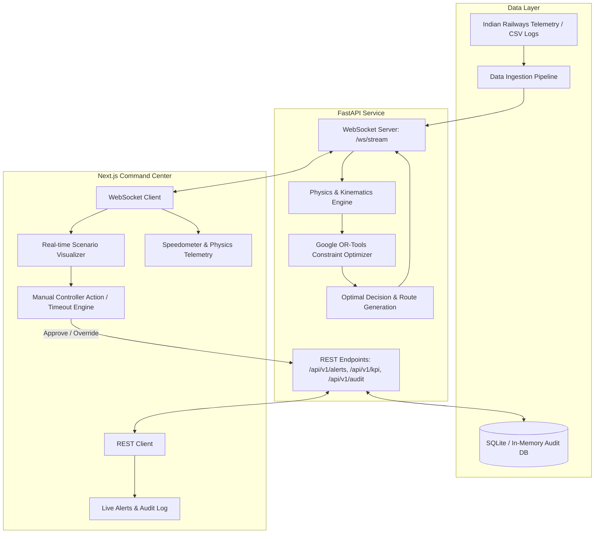

# 🛡️ AegisRail — AI-Driven Railway Traffic & Conflict Optimization System

[](https://www.sih.gov.in/)
[](https://fastapi.tiangolo.com/)
[](https://nextjs.org/)
[](https://developers.google.com/optimization)
[](https://tailwindcss.com/)
[](LICENSE)

> **AegisRail** is an intelligent, physics-informed railway decision support and autonomous conflict-resolution platform designed to streamline dispatching, prevent track bottlenecks, minimize kinetic energy losses, and ensure fail-safe operations for Indian Railways.

---

## 📌 Table of Contents

- [Overview](#-overview)
- [Key Features](#-key-features)
- [System Architecture](#-system-architecture)
- [AI & Kinematics Engine](#-ai--kinematics-engine)
  - [1. Real-Time Kinematics & Stopping Distance](#1-real-time-kinematics--stopping-distance)
  - [2. Google OR-Tools Constraint Optimization](#2-google-or-tools-constraint-optimization)
- [Tech Stack](#-tech-stack)
- [Directory Structure](#-directory-structure)
- [Getting Started](#-getting-started)
  - [Prerequisites](#prerequisites)
  - [Backend Setup (FastAPI + OR-Tools)](#backend-setup-fastapi--or-tools)
  - [Frontend Setup (Next.js + TailwindCSS)](#frontend-setup-nextjs--tailwindcss)
- [API & WebSocket Documentation](#-api--websocket-documentation)
- [Audit Trail & Fail-Safe Mechanism](#-audit-trail--fail-safe-mechanism)
- [Authors & Acknowledgments](#-authors--acknowledgments)

---

## 🌟 Overview

Modern railway networks face severe scheduling bottlenecks, signal delays, and collision risks when high-priority express trains and heavy freight carriers compete for shared track sections. 

**AegisRail** integrates real-world train kinematics, physics-based stopping distance models, and Google OR-Tools constraint satisfaction algorithms with a real-time reactive command-and-control interface. It empowers railway section controllers with:
1. Automated conflict detection and route priority recommendations.
2. Physics-aware momentum preservation to avoid costly freight halts.
3. 60-second controller response window with autonomous fail-safe override.
4. Tamper-evident audit logging for post-incident analysis.

---

## 🚀 Key Features

- **⚡ Real-time Telemetry Streaming**: High-throughput WebSocket pipeline streaming train positions, speeds, tonnage, and section statuses.
- **🧮 Physics & Kinematics Modeling**: Dynamic calculation of momentum ($p = mv$) and emergency stopping distances ($d = \frac{v^2}{2a}$) adjusted for train classifications (Freight, Express, Commuter, etc.).
- **🎯 Google OR-Tools Conflict Resolution**: Solves track occupancy constraints to maximize network momentum preservation while strictly preventing bottleneck collisions.
- **⏱️ Controller Action Countdown & Auto-Intervention**: 60-second interactive review countdown allowing manual intervention or autonomous fail-safe routing upon expiration.
- **🚨 Dynamic Alert Management**: Real-time triage board handling `CRITICAL`, `WARNING`, and `RESOLVED` safety alerts.
- **📜 SIH Compliance Audit Trail**: Structured logging of every human decision and automated override with millisecond timestamps.
- **🎨 Glassmorphic Mission Control UI**: Next.js dashboard featuring WebGL-powered aurora effects, animated speedometers, telemetry gauges, and interactive route diagrams.

---

## 🏗️ System Architecture



---

## 🧠 AI & Kinematics Engine

### 1. Real-Time Kinematics & Stopping Distance

Stopping distance is calculated dynamically based on train velocity and deceleration constants determined by rolling stock specifications:

$$d_{\text{stop}} = \frac{v^2}{2a_{\text{decel}}}$$

Where:
- $v$: Velocity converted to meters per second ($v_{\text{m/s}} = v_{\text{km/h}} \times \frac{5}{18}$)
- $a_{\text{decel}}$: Deceleration rate ($\text{m/s}^2$) mapped by train category:
  - **Heavy Freight**: $0.4\text{ m/s}^2$
  - **Freight**: $0.5\text{ m/s}^2$
  - **Express**: $0.8\text{ m/s}^2$
  - **Commuter / Local**: $1.0\text{ m/s}^2$
  - **High Speed**: $1.2\text{ m/s}^2$

### 2. Google OR-Tools Constraint Optimization

When two trains converge on a single-track block or switch bottleneck, the engine builds a Constraint Programming model (`cp_model`):

- **Decision Variables**: 
  - $x_1 \in \{0, 1\}$ ($1$ if Train 1 is cleared for main line, $0$ if diverted to loop)
  - $x_2 \in \{0, 1\}$ ($1$ if Train 2 is cleared for main line, $0$ if diverted to loop)
- **Bottleneck Mutual Exclusion**:
  $$x_1 + x_2 = 1$$
- **Objective Function**: Maximize network momentum preservation to minimize braking wear, energy expenditure, and schedule propagation delays:
  $$\max \left( x_1 \cdot \lfloor p_1 / 1000 \rfloor + x_2 \cdot \lfloor p_2 / 1000 \rfloor \right)$$
  *(where $p_i = m_i \cdot v_i$ is the momentum of Train $i$ in $\text{kg}\cdot\text{m/s}$)*

---

## 💻 Tech Stack

### Frontend
- **Framework**: [Next.js](https://nextjs.org/) (App Router, React 18)
- **Styling**: [Tailwind CSS](https://tailwindcss.com/) with custom glassmorphism and glow effects
- **Visuals & Motion**: [Framer Motion](https://www.framer.com/motion/) & [OGL](https://github.com/oframe/ogl) (WebGL Aurora shaders)
- **Communication**: WebSockets + REST API Client

### Backend
- **Framework**: [FastAPI](https://fastapi.tiangolo.com/) (Python 3.10+)
- **Optimization**: [Google OR-Tools](https://developers.google.com/optimization) (CP-SAT Solver)
- **Validation**: [Pydantic v2](https://docs.pydantic.dev/)
- **Server**: [Uvicorn](https://www.uvicorn.org/) with WebSocket support
- **Data Storage**: SQLite & CSV Historical Telemetry

---

## 📁 Directory Structure

```text
aegis-rail-SIH/
├── backend/
│   ├── ai_engine/
│   │   ├── __init__.py
│   │   ├── kinematics.py       # Physics engine: stopping distance & momentum
│   │   └── optimizer.py        # Google OR-Tools CP-SAT conflict resolution
│   ├── app/
│   │   ├── database.py         # Database connection setup
│   │   ├── models.py           # ORM schemas
│   │   ├── schemas.py          # Pydantic request/response schemas
│   │   └── websocket_manager.py# Client connection management
│   ├── data/
│   │   ├── historical_logs.csv # Indian Railways historical simulation data
│   │   └── indian_railways_logs.csv
│   ├── aegis_rail.db           # SQLite local store
│   ├── main.py                 # FastAPI application & WebSocket endpoints
│   ├── seed_data.py            # Database seeding utility
│   └── requirements.txt        # Python dependencies
├── frontend/
│   ├── app/
│   │   ├── alerts/page.jsx     # Alert triage & incident management
│   │   ├── dashboard/          # Section-specific views
│   │   ├── layout.jsx          # Root layout with responsive navigation
│   │   ├── globals.css         # Theme styles & custom utilities
│   │   └── page.jsx            # Primary Aegis Mission Control Center
│   ├── components/
│   │   ├── Aurora.jsx          # WebGL background visualizer
│   │   ├── BorderGlow.jsx      # Dynamic glowing container card
│   │   ├── Navbar.jsx          # Header navigation bar
│   │   ├── Footer.jsx          # Application footer
│   │   └── Speedometer.jsx     # Real-time train velocity gauge
│   ├── package.json            # Node.js dependencies & scripts
│   └── tailwind.config.js      # Tailwind theme configuration
└── README.md
```

---

## 🛠️ Getting Started

### Prerequisites
- **Node.js**: `v18.0.0` or later
- **Python**: `v3.10` or later
- **Git**: Installed and configured

---

### Backend Setup (FastAPI + OR-Tools)

1. **Navigate to the backend folder**:
   ```bash
   cd backend
   ```

2. **Create and activate a virtual environment**:
   - On Windows (PowerShell):
     ```powershell
     python -m venv venv
     .\venv\Scripts\Activate.ps1
     ```
   - On Linux / macOS:
     ```bash
     python3 -m venv venv
     source venv/bin/activate
     ```

3. **Install Python dependencies**:
   ```bash
   pip install -r requirements.txt
   ```

4. **Start the FastAPI server**:
   ```bash
   uvicorn main:app --reload --host 0.0.0.0 --port 8000
   ```
   *The API will be available at `http://localhost:8000` (API Docs: `http://localhost:8000/docs`).*

---

### Frontend Setup (Next.js + TailwindCSS)

1. **Navigate to the frontend folder**:
   ```bash
   cd ../frontend
   ```

2. **Install Node.js packages**:
   ```bash
   npm install
   ```

3. **Configure Environment Variables** (Optional, defaults to localhost):
   Create a `.env.local` file in `frontend/`:
   ```env
   NEXT_PUBLIC_API_URL=http://localhost:8000
   NEXT_PUBLIC_WS_URL=ws://localhost:8000/ws/stream
   ```

4. **Launch the development server**:
   ```bash
   npm run dev
   ```
   *Open [http://localhost:3000](http://localhost:3000) in your browser to access the command center.*

---

## 📡 API & WebSocket Documentation

### REST Endpoints

| Method | Endpoint | Description |
| :--- | :--- | :--- |
| `GET` | `/api/v1/alerts` | Fetches all active and historical safety alerts. |
| `POST` | `/api/v1/alerts/trigger` | Triggers a new manual or sensor-generated alert. |
| `GET` | `/api/v1/kpi` | Retrieves network health, throughput efficiency, and delays prevented. |
| `POST` | `/api/v1/audit/approve` | Logs controller approval or override into the immutable audit trail. |

### WebSocket Endpoint (`/ws/stream`)

- **Connection**: `ws://localhost:8000/ws/stream`
- **Client Message**: Send `"NEXT"` to receive the next conflict scenario.
- **Server Response**:
  ```json
  {
    "scenario": {
      "scenario_id": 101,
      "train_1_id": "TR-801",
      "train_1_type": "FREIGHT",
      "train_1_weight": 4500.0,
      "train_1_speed": 85.0,
      "train_2_id": "TR-404",
      "train_2_type": "EXPRESS",
      "train_2_weight": 1200.0,
      "train_2_speed": 110.0,
      "location": "Kanpur Switch",
      "delay_risk": "HIGH"
    },
    "ai_resolution": {
      "priority_train": "TR-801",
      "recommendation": "OR-TOOLS OPTIMAL: Clear TR-801 on main line. Preserves 106k momentum units. Divert TR-404.",
      "telemetry_data": {
        "TR-801": {
          "stopping_distance_meters": 556.71,
          "momentum_kg_ms": "1.06e+08"
        },
        "TR-404": {
          "stopping_distance_meters": 583.41,
          "momentum_kg_ms": "3.67e+07"
        }
      }
    }
  }
  ```

---

## 🔒 Audit Trail & Fail-Safe Mechanism

1. **Conflict Ingestion**: As two trains approach a common block, the telemetry stream triggers the physics engine and OR-Tools optimizer.
2. **Controller Decision Window**: The section controller is presented with the recommended route, telemetry gauges, and a **60-second decision timer**.
3. **Manual Approval / Override**: The controller can approve the AI recommendation or choose an alternate train.
4. **Autonomous Fail-Safe**: If no response is received before countdown reaches zero, the system automatically executes the safest kinematic recommendation to avoid deadlocks.
5. **Permanent Audit**: The decision, timestamp, train IDs, and intervention method are logged securely to `/api/v1/audit/approve`.

---

## 👥 Authors & Acknowledgments

- **Team AegisRail** — Smart India Hackathon (SIH)
- Dedicated to the continuous advancement and safety of Indian Railways.
